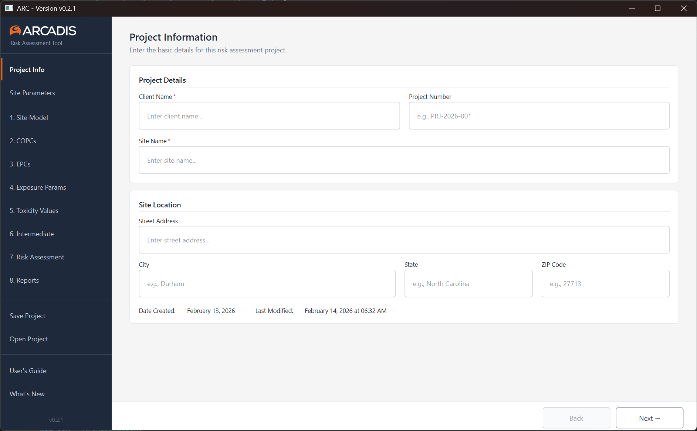

# ARC User's Guide

**Version:** 0.2.1  
**Last Updated:** February 14, 2026

---

## Welcome

ARC is a desktop risk calculator designed for environmental consultants performing forward risk assessments of contaminated sites. It walks you through the full assessment workflow, from defining your site and selecting chemicals of potential concern, through exposure calculations and toxicity evaluation, to generating final risk assessment reports.

This guide covers how to get started with ARC and walks through each step of a typical assessment.

---

## Table of Contents

1. [Installation](#installation)
2. [Launching ARC](#launching-arc)
3. [Creating or Opening a Project](#creating-or-opening-a-project)
4. [Workflow Overview](#workflow-overview)
5. [Step 1: Project Information](#step-1-project-information)
6. [Step 2: Site Parameters](#step-2-site-parameters)
7. [Step 3: Site Model](#step-3-site-model)
8. [Step 4: Chemicals of Potential Concern (COPCs)](#step-4-chemicals-of-potential-concern-copcs)
9. [Step 5: Exposure Point Concentrations (EPCs)](#step-5-exposure-point-concentrations-epcs)
10. [Step 6: Exposure Parameters](#step-6-exposure-parameters)
11. [Step 7: Toxicity Values](#step-7-toxicity-values)
12. [Step 8: Intermediate Calculations](#step-8-intermediate-calculations)
13. [Step 9: Risk Assessment](#step-9-risk-assessment)
14. [Step 10: Reports](#step-10-reports)
15. [Saving and Managing Projects](#saving-and-managing-projects)
16. [Troubleshooting](#troubleshooting)

---

## Installation

ARC is distributed as a standalone Windows executable. No installation wizard or administrator privileges are required.

1. Download the latest version of **ARC.exe** from the official distribution site.
2. Place the file in any folder you'd like (e.g., your Desktop or a dedicated tools folder).
3. Double-click **ARC.exe** to launch the application.

That's it. No setup, no installer, no IT department required.

---

## Launching ARC

### First Launch

The first time you run ARC, the application will automatically set up its internal reference databases. This happens silently in the background and only takes a moment. You won't need to configure anything.

### Subsequent Launches

Each time ARC starts, it checks for available updates. If a newer version is available, you'll see a prompt giving you the option to download the update. You can choose to update now or skip and continue working with your current version.

Once startup is complete, you'll be able to open an existing assessment or start a new one.

---

## Creating or Opening a Project

When ARC is ready, you have two options:

- **New Assessment**: Creates a fresh .arc project file and opens it on the Project Information screen.
- **Open Assessment**: Browse to and open an existing .arc file to continue a previous assessment.

ARC projects are saved as **.arc files**, which you can organize, share with colleagues, or archive alongside your other project deliverables.

You can also access these options at any time from the left sidebar using **Save Project** and **Open Project**.

---

## Workflow Overview

ARC guides you through a risk assessment using a step-by-step workflow. The left sidebar shows all steps in order:

1. **Project Info**: Basic project and site identification
2. **Site Parameters**: Physical and environmental characteristics of the site
3. **Site Model**: Conceptual site model configuration
4. **COPCs**: Selection of Chemicals of Potential Concern
5. **EPCs**: Exposure Point Concentrations
6. **Exposure Params**: Receptor and pathway exposure parameters
7. **Toxicity Values**: Chemical toxicity reference values
8. **Intermediate**: Intermediate calculation results
9. **Risk Assessment**: Final risk and hazard calculations
10. **Reports**: Generate assessment deliverables

You can navigate between steps using the sidebar links or the **Back** and **Next →** buttons at the bottom of each screen. Required fields are marked with an asterisk (*).

---

## Step 1: Project Information

The Project Information screen is the first thing you'll see when creating a new assessment. This is where you identify the project and site being evaluated.

### Project Details

| Field | Required | Description |
|-------|----------|-------------|
| **Client Name** | Yes* | The name of the client for this assessment. |
| **Project Number** | No | Your internal project or task number (e.g., PRJ-2026-001). |
| **Site Name** | Yes* | The name of the site being assessed. |

### Site Location

| Field | Description |
|-------|-------------|
| **Street Address** | Street address of the site. |
| **City** | City where the site is located. |
| **State** | State where the site is located. |
| **ZIP Code** | ZIP code for the site location. |

At the bottom of this section, ARC automatically records the **Date Created** and **Last Modified** timestamps for the project.

Once you've entered the project details, click **Next →** to proceed to Site Parameters.

---

## Step 2: Site Parameters

*Section to be completed as this screen is finalized.*

---

## Step 3: Site Model

*Section to be completed as this screen is finalized.*

---

## Step 4: Chemicals of Potential Concern (COPCs)

*Section to be completed as this screen is finalized.*

---

## Step 5: Exposure Point Concentrations (EPCs)

*Section to be completed as this screen is finalized.*

---

## Step 6: Exposure Parameters

*Section to be completed as this screen is finalized.*

---

## Step 7: Toxicity Values

*Section to be completed as this screen is finalized.*

---

## Step 8: Intermediate Calculations

*Section to be completed as this screen is finalized.*

---

## Step 9: Risk Assessment

*Section to be completed as this screen is finalized.*

---

## Step 10: Reports

*Section to be completed as this screen is finalized.*

---

## Saving and Managing Projects

### Saving Your Work

Use **Save Project** in the left sidebar (or **Ctrl+S**) to save your assessment at any time. ARC saves everything to a single **.arc file** that contains all of your project data, chemical selections, parameters, and calculation results.

### File Management Tips

- Keep .arc files organized alongside your other project documents.
- Share .arc files with colleagues so they can review or continue an assessment.
- ARC files are self-contained. No external database connections or network access are needed once the application is running.

---

## Troubleshooting

### First Launch Issues

If ARC fails to start on first launch, it may not have been able to set up its reference databases. Ensure that your user account has write access to your local AppData folder. Contact your IT department if you're unsure.

### Update Check Failures

If ARC cannot check for updates (e.g., due to a firewall or lack of internet access), it will continue to function normally with the current version. Updates can also be downloaded manually from the distribution site.

### General Tips

- Make sure you're running the latest version of ARC for the best experience and most current regulatory data.
- If something looks wrong with calculation results, verify that all required fields are completed on earlier screens. ARC depends on upstream data for downstream calculations.

---

*This guide is a living document and will be updated as new features are added to ARC.*
